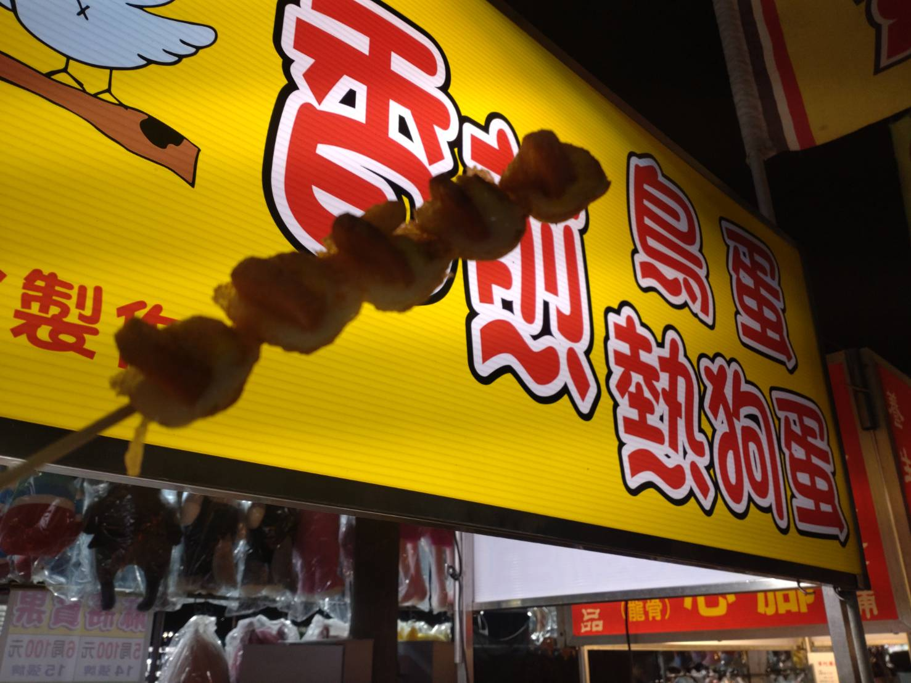
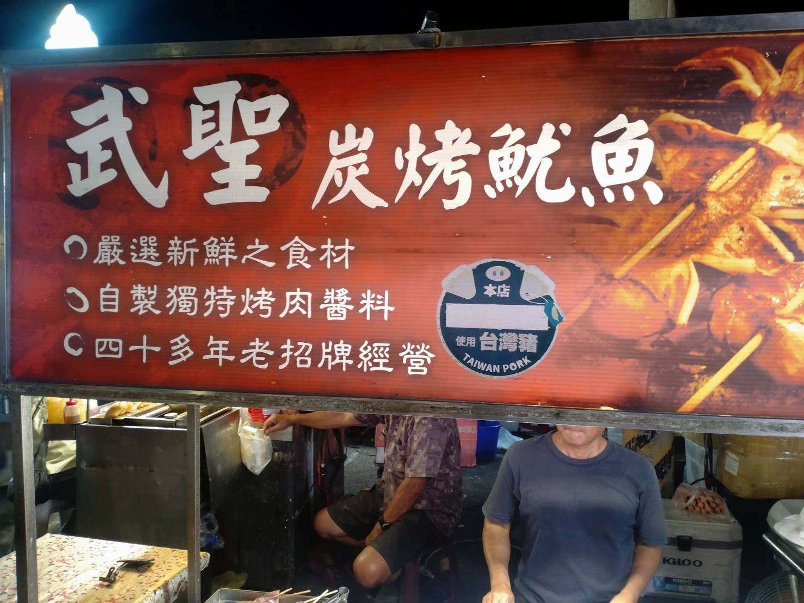
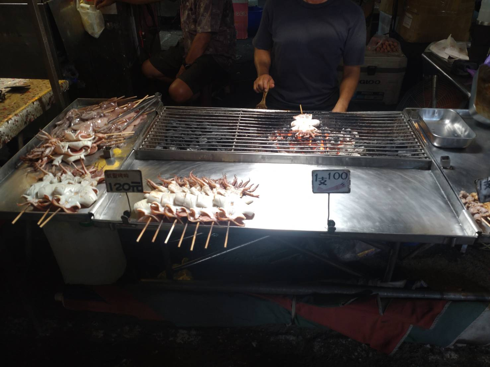
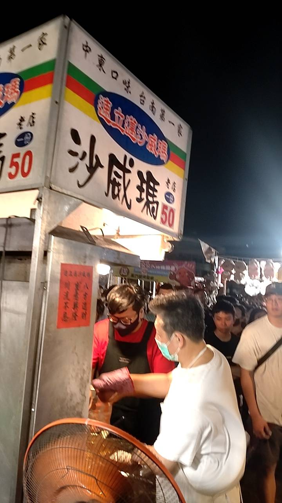

意外得知一起玩怪物彈珠的朋友阿醉要來台南參加路跑([蕨對路跑](https://irunner.biji.co/2025JustRun))
而我剛好在台南，對方知道之後跟我分享自己的行程--要去逛逛武聖夜市
身為夜市愛好者的我，燃起想去夜市的慾望
查一查相關資訊，就自己出發了
朋友還蠻意外，以為會一起去
我是想早點開始早點結束，晚上還有跟MMORPG的朋友有約
而且有些東西早點開始逛會比較不需要排隊，而且不需要顧慮太多
會不會碰面就真的是另一回事情了，至少我有先享受到屬於自己的夜市
之後可以享受到與朋友一起聊天的夜市

雖然武聖有停車場，但是我直覺都是附近不好停車，或是停車要收費之類的
就將車停得遠遠，自己步行些距離過去，到那邊才發現那裡有不用收費的停車場，我來的早空位還很多
我笑了笑就這樣吧，反正我可接受的步行距離一直都蠻廣

獨行的部分當然是先逛逛，買一些自己想吃小東西，我還以為我會買地瓜球的
意外的沒有買

倒是看到蠻新奇的鳥蛋組合，鳥蛋熱夠蛋，我本身喜歡鳥蛋的，但是出門都沒什麼機會買，總覺得會被批判浪費錢之類的
但是這是加了熱狗的鳥蛋，當然吃一波了

之後是我很喜歡的烤魷魚，真的要說他的缺點就是偏貴，看到有人寫文章推薦就忍不住買一枝來嚐嚐
唯一美中不足的部分是，他把魷魚剪了，我最期待直接啃整串的，現在變成剪好的躺在塑膠袋內，心情上還挺微妙的

我很喜歡逛夜市，但是夜市價格對我來說越來越不友善，可能是收入變少或是陷在買房的焦慮上吧
最近我也把自己壓榨過頭，剛好需要好好放鬆下，花費什麼的就不那麼在意了，

看著別人跟攤主挑戰量人麻將，默默地為挑戰者加油，可惜最後攤主還是技高一籌

最後朋友要過來了，想說來排一個感覺很有人氣的店家
他來了就剛好可以試試味道不用等太久，但是排得比想像中的還要久，朋友幫我排另一家沙威瑪他們買到了我還在排隊

另一家要排隊的是拔絲地瓜，那是我在單人行的時候買的，感覺沒有想像中的好，不適合單人吃
多人分著吃會感覺比較好，單人行的劣勢出來了，
很多東西都有買兩份會比較便宜，有些東西好吃但不適合一直吃會容易吃膩

我久違被關心近來過得如何，
有些過去的事，我不知道有沒有成功讓他變成過去的故事，
還是純純的吐吐苦水，我就不得而知，不過朋友以及他的友人給了我很多情緒價質
剛好身上有帶筆電，就讓朋友看看我搞的東西，
當下就出現很有趣的畫面，我們拿著筆電逛著夜市，非常有社畜趕工的樣子
不過side project 完成差不多之後，我也該準備找下一個工作了

順便說，我朋友是同性婚姻的受益者，他老公勸我不要來他們圈內搶對象
這評價老實說挺微妙的，雖然說我好看，但是就期待的有些不太一樣
不過我朋友是真的帥

